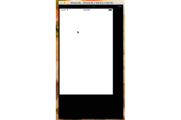

# JKPinTu-Swift
现学现做的第一个swift版本拼图游戏demo

常规模式，对换模式任你选择，
用到了花瓣的API，各种萌妹子~😄😄 让你一次看不够

用到的库：

+ [Alamofire](http://item.jd.com/11598468.html)
+ [Kingfisher](http://item.jd.com/11598468.html)
+ [DGElasticPullToRefresh](http://item.jd.com/11598468.html)
+ [SwiftyJSON](http://item.jd.com/11598468.html)

######另外请忽略这没有设计感的UI

持续更新中...

另外这里是我的[创业项目](https://itunes.apple.com/app/id958163620)，下载支持一下吧，欢迎交流。
